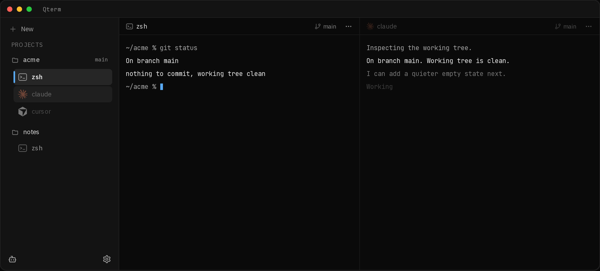
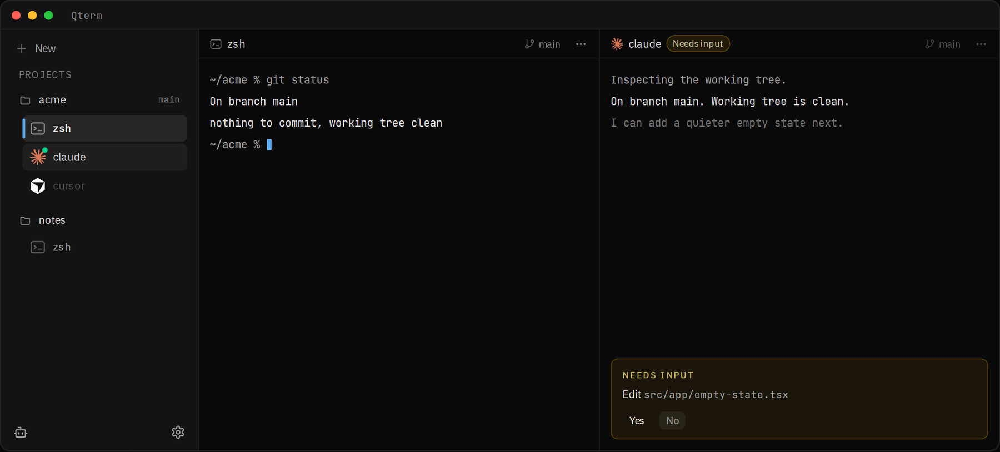

# Qterm

**The best agentic terminal.**

Fast, clean, and light. Projects, splits, and your agents in one quiet window.

[Download for Mac](https://qterm.darshannaik.com) · [Latest release](https://github.com/Darshan-Naik/Qterm/releases/latest)

  

  

---

## Why Qterm

**Projects, not clutter.**
Map local folders as projects. Open as many terminals as you need under each one, rename them, and keep home shells separate when you’re just experimenting.

**Splits that feel native.**
Split right or down and work side by side. Each pane has its own title and menu. No crowded tab strip fighting for attention.

**Built for flow.**
Command palette, thoughtful shortcuts, dark and light themes, and a sidebar that stays out of the way until you need it.

**Ready for agents.**
Keep your coding agents in the same window as your terminals, without turning Qterm into another chat app.

---

## Designed for Mac

Qterm is built for Apple Silicon. Traffic lights, menus, and chrome that feel at home next to the tools you already use.

---

## A quieter workspace

- Simple sidebar: new terminals and projects
- Git branch awareness on project folders
- Sessions that remember where you left off
- Settings that stay out of the main view until you open them

---

## Get started

Download Qterm from [qterm](https://qterm.darshannaik.com), open the app, and create a terminal, or add a project folder and go. When a newer version is out, Qterm will offer an update in the app.

---

## License

Qterm is licensed under the [MIT License](LICENSE).

## Contributing

See [CONTRIBUTING.md](CONTRIBUTING.md) for setup, coding guidelines, and pull request expectations.

---

*Qterm: terminal, without the noise.*
